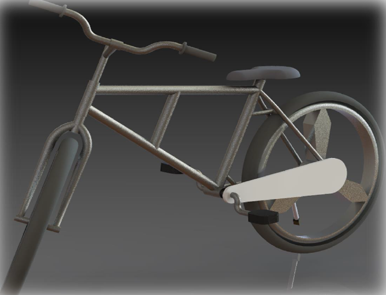
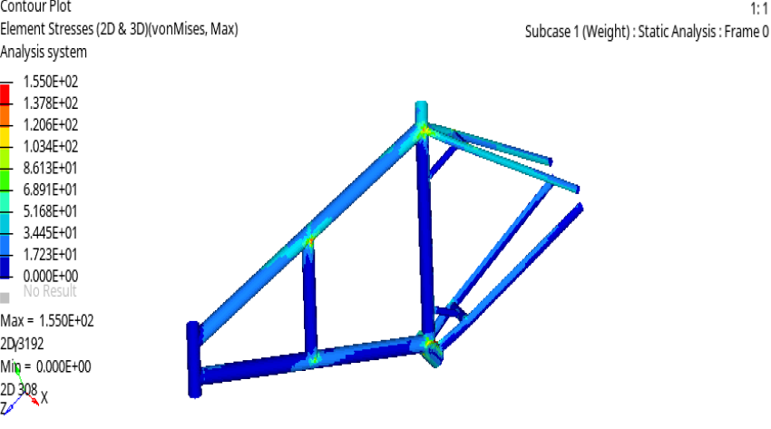
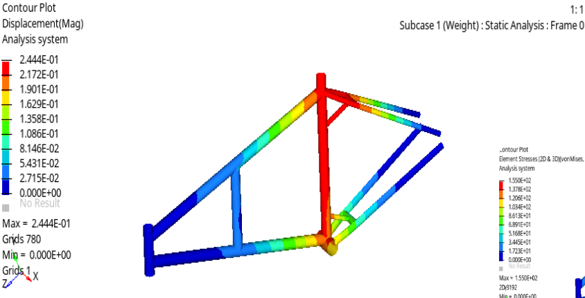

# Bicycle Chassis Design and Finite Element Analysis (FEA)

A comprehensive structural design and implicit static analysis of a bicycle chassis performed to validate mechanical integrity under heavy loading conditions.

---

## Project Overview
* **Objective:** Design a bicycle frame and validate structural safety using Finite Element Analysis (FEA) due to physical prototyping constraints.
* **Software Tools:** HyperMesh, OptiStruct.
* **Material:** AISI 4130 alloy steel (chosen for its high strength-to-weight ratio, bending strength, and stiffness).

---

## Methodology & FEA Workflow

1. **Geometry & Mid-Surfacing:**
   * Imported geometry via IGES format.
   * Performed geometry cleanup and extracted mid-surfaces for uniform tube thickness modeling (wall thickness set to 1.6 mm).

2. **Discretization (Meshing):**
   * Target element size: 4.0 mm.
   * Quality checks enforced: Jacobian set to 0.6 and Warpage limited to 15 degrees.

3. **Boundary Conditions & Loading:**
   * **Constraints:** Hard points and structural end points fixed as stationary constraints.
   * **Load Application:** Simulated a 500 kg equivalent load (5000 N) acting downwards, distributed evenly across selected nodes at the seat mounting position.

---

## Results & Validation

* **Max Stress:** 155 MPa (von Mises stress).
* **Max Deformation:** 0.2444 mm.
* **Factor of Safety (FOS):** Calculated at 5.09, confirming the structure remains well within safe elastic limits.

---

## Project Visuals

### CAD Model Render

### Stress Analysis (von Mises)

### Displacement Analysis

---

## Repository Structure
* `Bicycle Report.pdf`: Contains the complete engineering project report PDF.
* `CAD.png`, `Stress.png`, `Displacement.png`: Visual assets and FEA contour plots.
